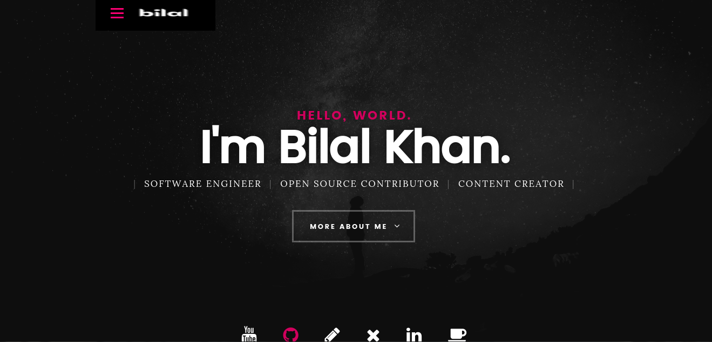

# 🎨 Ibilalkayy's Portfolio Website 🌐

Welcome to the GitHub repository of [ibilalkayy.com](https://ibilalkayy.com) - my personal corner on the internet where I showcase my skills, projects, and experiences!

## 🚀 Features

- 📜 Dynamic scrolling and sections showcasing my skills, projects, and experience.
- 💡 Dark/light theme toggle for a great user experience.
- 📱 Fully responsive, ensuring a seamless experience on all devices.
- 🚢 Deployed on Netlify for maximum uptime and performance.

## 🛠️ Built With 

- HTML, CSS, and JavaScript: For building the foundation of the site.

## 🖼️ Screenshot

## 📥 Installation and Local Development

To run this site locally, follow these steps:

1. Clone the repository:

       git clone https://github.com/ibilalkayy/my-portfolio.git
       
2. Go inside the directory

       cd my-portfolio

## 🙌 Contributions

While this is primarily a personal project, I'm open to collaboration and suggestions. Feel free to submit issues, pull requests, or just drop a star ⭐ if you like what you see!

## 📜 License

This project is under the Apache 2.0 License. See [LICENSE](LICENSE) file for details.